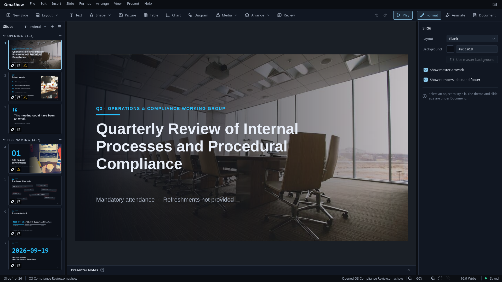
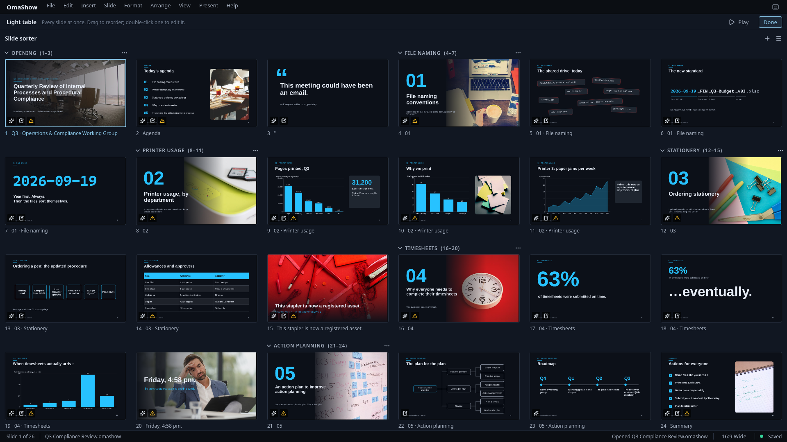
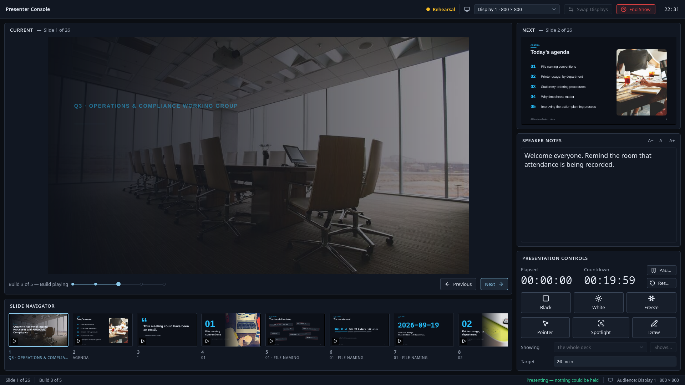
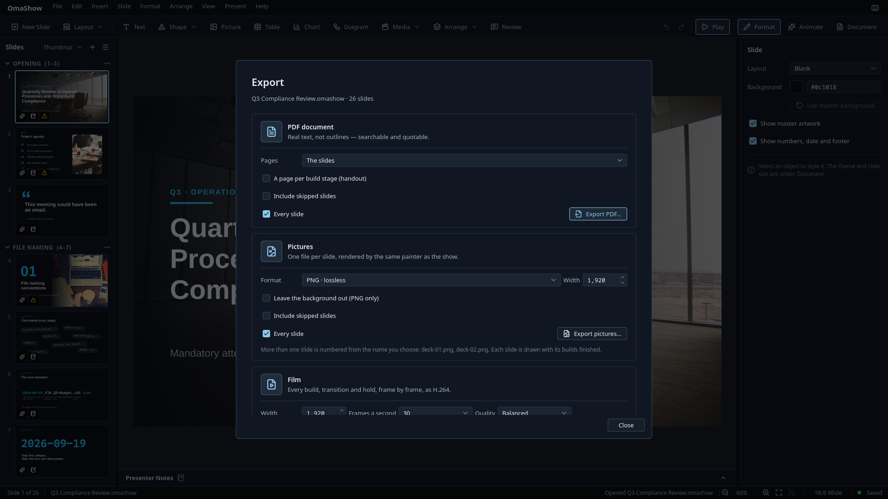

# OmaShow

Make and present slide decks on Omarchy. OmaShow works offline, follows your
Omarchy theme and can be driven entirely from the keyboard. It opens PowerPoint
and Keynote decks and saves back to PowerPoint.



## Install

OmaShow is made for Omarchy.

1. Open a terminal with **Super + Enter**.
2. Copy and paste these three lines, then press Enter:

   ```sh
   git clone https://github.com/28allday/omashow.git ~/omashow
   cd ~/omashow
   ./bin/install
   ```

3. Type your password when asked.
4. If it asks which spelling dictionary to use, press Enter for British
   English, or type another (`hunspell-en_us` for American English).
5. When it lists the packages it needs and asks to proceed, press Enter.

The first install takes a few minutes, because OmaShow is built on your
computer. When it finishes, open OmaShow from the app launcher: press
**Super + Space** and type **OmaShow**.

### Updating

```sh
cd ~/omashow
git pull
./bin/install
```

### Removing

```sh
sudo pacman -R omashow
rm -rf ~/omashow
```

## Getting started

OmaShow opens on the **Start centre**. Pick a theme (Midnight, Paper or Grove),
a slide size and a first slide, or open one of your recent decks, a template
or one of the example decks that come with the app.

The window has three parts:

- **The toolbar** adds slides and things to put on them: text, shapes (the pen
  and freehand tools are under Shape), pictures, tables, charts, diagrams,
  audio and video. It also has Arrange, Review, Undo and Play.
- **The slide list** on the left. Switch it between thumbnails, a compact
  list, an outline and the light table, a full view of every slide for
  reordering.
- **The sidebar** on the right, with three switches:
  - **Format** styles whatever is selected, or the slide when nothing is.
  - **Animate** sets builds and the slide's transition, with a timeline under
    the slide.
  - **Document** holds the theme, slide size, language, masters and presenter
    setup.

Some tasks open in their own room: editing masters and layouts, Review,
presenter setup and the light table. Press **Done** or Escape to go back to
your slide.

Press **Ctrl+K** to find any command by name.

## What you can do

### Slides and text

- Type straight onto the slide. Format a whole box or just a few words: font,
  size, weight, italic, underline, strike-through, colour, raised or lowered
  text.
- Bullets and numbering, nested with Tab; alignment, spacing and indents; up to
  six columns; right-to-left text.
- Keep a look as a named **text style**. Change the style and every box that
  uses it follows.
- Put words along the outline of a shape (Arrange ▸ Put the text on this shape).
- Write **equations** the way you would by hand (`^`, `_`, `\frac`, `\sqrt`,
  `\sum`, Greek letters and more). They stay sharp in PDFs.
- **Spelling** is checked in the deck's language, set in Document ▸ Language.
  Words you teach it are saved in the deck, so they travel with the file.
  Straight quotes and double hyphens turn into proper typographic marks; you
  can switch that off.
- **Sections** group slides. You can collapse sections, move them and skip
  slides in the show without deleting them.

### Shapes, pictures and media

- 24 basic shapes plus arrows, callouts, flowchart shapes and symbols. Fill
  them with solid colours, gradients, patterns or pictures, and add outlines
  and shadows. Arrange ▸ Combine shapes merges, cuts or splits overlapping
  shapes.
- **Connectors** join two objects and stay attached when they move.
- Draw your own shapes with the pen or freehand tools and edit their points.
- **Pictures** in PNG, JPEG, WebP or SVG: crop on the slide, set a focal point,
  mask to a shape, and adjust brightness, contrast, saturation and tint.
  Replacing a picture keeps its crop, effects and animation.
- **Audio and video** (MP4, MOV, MKV, WebM, WAV, MP3, FLAC, Ogg): embed a clip or
  link to the file, trim it, set the volume and loop, and start it with the
  slide or on a click.
- **Optimise** makes pictures and films smaller. Compare before and after, then
  keep the original or throw it away.
- **Tables** with merged cells, header rows, borders, sorting and CSV/TSV
  import. **Charts** in ten types, with the data edited in place. Tables and
  charts can stay linked to a CSV file and refresh when you ask.
- **Diagrams** for processes and hierarchies, built from ordinary shapes you
  can keep editing.
- Links on any object: web pages, email, another slide, or ending the show.

### Design

- Switch themes at any time. Edit **masters and layouts** with their colours
  and fonts, and apply a layout to one slide, a selection or the whole deck,
  with a before-and-after preview.
- Slide numbers, date and footer come from the masters.
- **Import from deck** brings slides from another deck with their design.
- Change the **slide size** and have everything scaled to fit.
- Keep any deck as a **template** (File ▸ Keep as template…).

### Animation

- **Builds** bring objects in or take them out: fade, rise, move, scale, spin,
  an emphasis that swells and settles, text that arrives a paragraph, word or
  letter at a time, and travel along a path you draw.
- Start builds on a click, with the previous build or after it, and set their
  timing on the timeline.
- **Transitions:** cut, fade, fade through black, push, cover and uncover (in
  four directions), zoom, whirl and **morph**, which moves matching objects
  from one slide to their places on the next.
- A slide can move on by itself after a set time. **Rehearse** times each slide
  for you.



### Review

- An outline of the whole deck, editable in place.
- Comments on a slide or an object, with replies. They are saved in the deck.
- Find and replace across slides, tables, chart data and notes.
- Checks for missing picture descriptions, low-contrast or too-small text,
  text that doesn't fit, slides without titles, missing typefaces and more.
  Jump to each one, or mark it as not a problem.

### Presenting

- Press **F5** or Play. With two displays, the audience sees the slides and you
  get the presenter console: current and next slide, notes, a timer and a
  slide picker. Choose which display is which in Present ▸ Presenter setup….
- On one display the show fills the screen. **Rehearse in windows** shows the
  console alongside it.
- Black or white out the screen, freeze it, point, spotlight or draw on the
  slide. Drawings disappear when the show ends unless you choose to keep them.
- **Custom shows** present a chosen order of slides without copying them.
- Notifications are silenced and the screen stays awake while you present.



### Export and sharing

- **PDF**: slides, slides with notes, an outline, handouts with several slides
  a page, or one page per build step.
- **Pictures**: PNG or JPEG at any width, with or without the background.
- **Film**: an H.264 video of the whole show with every build and transition.
  Sound is not included yet.
- **PowerPoint**: a `.pptx` anyone with PowerPoint, Keynote, Google Slides or
  LibreOffice can open.
- **Print**, or **package** a deck as a zip with copies of every file it links
  to.

Exports run in the background and can be cancelled.



### PowerPoint and Keynote decks

Open a `.pptx` or `.key` file like any other deck. It arrives as a new, unsaved
OmaShow deck, and the original is never changed. A bar across the top lists
anything that couldn't be brought across. If the deck uses typefaces you don't
have, **Choose typefaces…** suggests a replacement for each one.

### Accessibility

Everything can be reached from the keyboard, and the interface works with
screen readers. **Less movement** turns off interface animation and makes the
show jump to each slide instead of animating. **Stronger contrast** firms up
edges and faint text. Both are your settings and never change the deck.

## Keys

| Key | Action |
| --- | --- |
| `Ctrl+K` | Find a command |
| `Ctrl+O` / `Ctrl+S` / `Ctrl+Shift+S` | Open / Save / Save as |
| `Ctrl+Shift+N` | Start centre |
| `Ctrl+N` | Add slide |
| `Ctrl+D` | Duplicate the selection, or the slide when nothing is selected |
| `Ctrl+C` / `Ctrl+X` / `Ctrl+V` | Copy / cut / paste |
| `Ctrl+Z` / `Ctrl+Shift+Z` | Undo / redo |
| `T` / `S` | Add text / shape |
| `Ctrl+A` | Select everything on the slide |
| `Shift`-click / drag on empty space | Add to selection / select an area |
| `Alt`-click | Select the object behind |
| `Ctrl+G` / `Ctrl+Shift+G` | Group / ungroup |
| `Enter` / `Escape` | Go into / out of a group |
| Arrow keys | Nudge the selection |
| `Ctrl++` / `Ctrl+-` | Zoom in / out |
| `Ctrl+0` / `Ctrl+1` / `Ctrl+Shift+0` | Fit slide / 100% / fit selection |
| `Ctrl`+wheel / middle-button drag | Zoom at the pointer / pan |
| `Ctrl+Shift+↑` / `Ctrl+Shift+↓` | Move the selected slides |
| `Ctrl+E` | Export PDF |
| `F5` | Start the show |
| `Space` / `→` / `Page Down` | Next build or slide |
| `←` / `Page Up` | Previous build or slide |
| `B` / `W` / `F` | Black screen / white screen / freeze |
| `Escape` | End the show, or leave a room |

## Your files

- Decks are saved as `.omashow` files. Pictures and embedded media are stored
  inside the deck, so moving or deleting the originals can't break it.
- Each save keeps the previous version next to the deck as `.bak`.
- If OmaShow closes unexpectedly, it offers to recover your unsaved work the
  next time it opens.
- If a deck is open in another OmaShow window, or the file changes on disk,
  OmaShow tells you and lets you reload, keep your version or save elsewhere.

OmaShow keeps its own data in these folders, and removing the package leaves
them in place:

| Folder | What's in it |
| --- | --- |
| `~/.config/omashow/` | Recent decks, panel sizes, view and review settings |
| `~/.config/omarchy/omashow.conf` | Your presenter display choice |
| `~/.local/share/omashow/` | Recovery copies of unsaved work, and your templates |

OmaShow makes no network connections.

## From the command line

OmaShow can make, change and export decks without opening a window:

```sh
omashow new talk.omashow --theme 1 --size 16:9 --slides 4
omashow import talk.pptx --out talk.omashow
omashow inspect talk.omashow
omashow apply talk.omashow changes.json
omashow review talk.omashow
omashow export talk.omashow --kind pdf --out talk.pdf
omashow export talk.omashow --kind pptx --out talk.pptx
```

Each command answers in JSON. `omashow ops` lists every change `apply` can
make. See [the command-line guide](docs/cli.md) for the full reference.

## Limits

- Exported films have no sound yet.
- Links in exported PDFs aren't clickable.
- Typefaces aren't embedded in decks. A package lists the typefaces a deck
  needs instead, because most font licences don't allow sending them on.
- Video must be SDR, up to 4096 × 4096. Embedded clips can be up to 64 MB;
  linked files up to 2 GB.

## Licence

OmaShow is free software: you can redistribute it and/or modify it under the
terms of the GNU General Public License as published by the Free Software
Foundation, either version 3 of the License, or (at your option) any later
version. See [LICENSE](LICENSE) for the full text, and
[THIRD-PARTY-NOTICES.md](THIRD-PARTY-NOTICES.md) for the work it builds on.

Copyright (C) 2026 Gavin Nugent.
